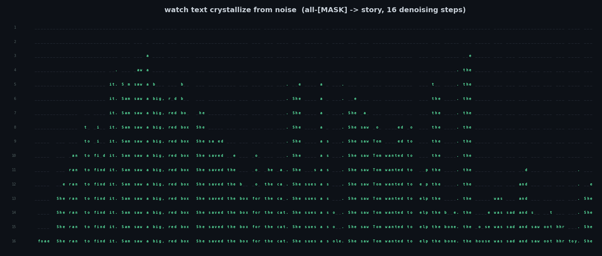
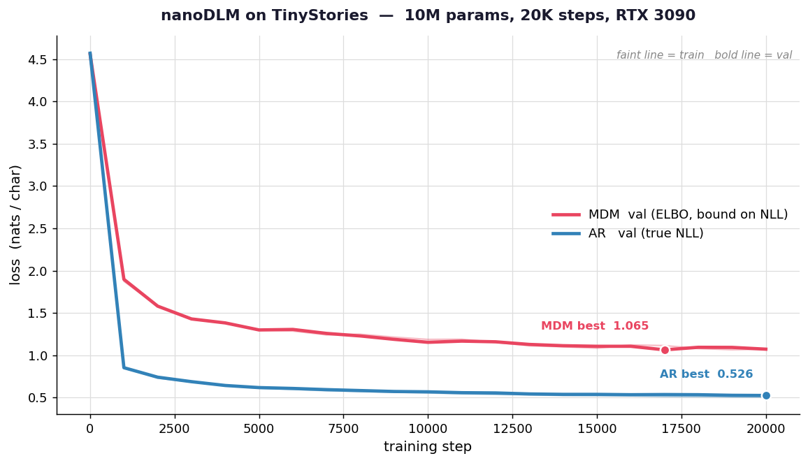
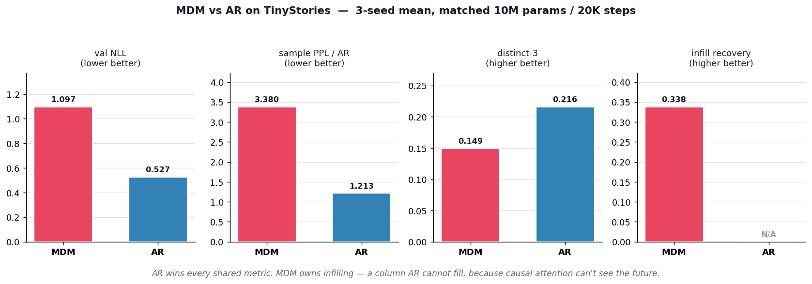

# nanoDLM



The simplest masked-diffusion language model you can actually train, debug,
and learn from. If [nanoGPT](https://github.com/karpathy/nanoGPT) is the
minimum *autoregressive* LM, this is the minimum *diffusion* LM — char-level,
no tokenizer, no `diffusers`, no HF Trainer. ~1100 lines of plain PyTorch,
one afternoon to read end to end.

The picture above is the whole idea: start from a sequence of all-`[MASK]`
tokens and, over 16 steps, commit the model's most confident predictions
until a story falls out of the noise. That's a diffusion language model.
An autoregressive LM writes left-to-right and never looks back; this one
denoises the *whole sequence at once* and revisits every position.

This is a fork. It does three things to the original educational repo:
**fixes real bugs** in the objective and sampler, **modernises** the
backbone (RoPE + self-conditioning), and **puts MDM head-to-head with a
matched autoregressive baseline** so the trade-off is a table you can read,
not a claim you have to trust.

## install

```
pip install torch numpy
```

That's it. No `transformers`, no `tiktoken`, no `wandb`. (`matplotlib` if
you want to regenerate the plots in this README, but you don't need to.)

## quick start

Grab a corpus and turn it into a stream of integers:

```sh
python prepare.py                        # 1 MB of tiny Shakespeare
python prepare.py --dataset tinystories  # 50 MB of TinyStories (recommended)
```

Tiny Shakespeare is the canonical char-level toy set, but it's *small* and
*archaic* — a 10M-param diffusion model trained on it gets the cadence of
Shakespeare but the words drift (`thou hast done that scaped with my death`).
[TinyStories](https://huggingface.co/datasets/roneneldan/TinyStories) —
simple modern children's stories — is small enough to stay an afternoon
project and rich enough that the same model writes actual sentences. Use it.

Now train. On a single RTX 3090, ~22 minutes, no `torch.compile` needed:

```sh
python train.py
python sample.py --verbose --steps 64
```

`--verbose` prints the denoising trajectory live — you watch `_` placeholders
turn into characters, step by step, exactly like the image at the top.

## the lesson: it's about five lines on top of nanoGPT

If you know nanoGPT, here's the entire conceptual diff. Six changes:

| # | Change | File |
|---|---|---|
| 1 | Drop the causal mask in attention (the model sees the whole sequence) | `model.py` |
| 2 | Vocab += 1 for a `[MASK]` token | `model.py` |
| 3 | No timestep input — the model infers the noise level from how many `[MASK]`s it sees ([MD4](https://arxiv.org/abs/2406.04329)) | `model.py` |
| 4 | Loss = 1/t-weighted cross-entropy on the masked positions, normalised by **B·T** | `train.py` |
| 5 | Sampler = iterative low-confidence remasking, **sampling from the categorical** | `sample.py` |
| 6 | Schedule against the *initially-masked* count, so infilling can't overwrite frozen tokens | `sample.py` |

The training step, in full:

```python
t    = torch.rand(B, 1, device=x.device).clamp(min=1e-3)   # noise level per example
mask = torch.rand(B, T, device=x.device) < t               # Bernoulli(t) per token
x_t  = torch.where(mask, MASK_ID, x)                        # corrupt

logits   = model(x_t)
loss_tok = F.cross_entropy(logits.reshape(-1, V), x.reshape(-1),
                           reduction="none").view(B, T)
loss = (loss_tok * mask / t).sum() / (B * T)                # the Sahoo et al. ELBO
```

That's the whole diffusion-LM training objective. No score networks, no
Gaussian noise, no embedding-space tricks. It's BERT with a random mask
ratio and a 1/t weight, and the 1/t weight is the absorbing-state ELBO —
see [Sahoo et al. 2024](https://arxiv.org/abs/2406.07524) §3.

## how it trains



Both models are 10M params, 6 layers, 384-dim, RoPE positions, trained for
20K steps on the 50 MB TinyStories slice with identical optimiser settings.
The MDM is optimising an ELBO (an *upper bound* on NLL); the AR is
optimising NLL directly. They are not the same axis — but each curve is an
honest read of how its own model is doing.

The MDM lands at **1.065 nats/char**. The AR lands at **0.526**. The AR
also does not overfit here — train and val track each other to the last
step — because 50 MB is plenty of data for a 10M model. (On 1 MB
Shakespeare it overfits hard, which is why `train_ar.py` always keeps the
best-val checkpoint.)

## samples

Unconditional, from the MDM after 20K steps (`sample.py --steps 128 --temperature 0.6`):

```
Tim and Tim was sad and run for it. Tim and his mom and the ball all day.
The cat was very sad and hit Tim and Tim and Tim was not the ball and the
cat saw the house. Tim and Tim saw the box and saw Tim and Tim and Tim saw
his mom and dad.
```

The matched AR baseline, same corpus (`sample_ar`, `--temperature 0.7`):

```
Once upon a time, there was a big bear named Ben. Ben lived in a small
house with his mom and dad. They loved to play together all day long. One
day, they found a big box. Ben was very curious about what was inside.
```

lol — the AR is clearly the better storyteller `¯\_(ツ)_/¯`. That's the
honest result and we'll get to the numbers. But the MDM can do one thing
the AR architecturally *cannot*:

## the killer feature: infilling

An autoregressive model writes left-to-right. It cannot condition on tokens
to the *right* of the cursor, so it physically cannot fill a hole in the
middle of a sequence. A diffusion LM does this for free — freeze the known
tokens, let the remasking loop denoise the rest:

```sh
python infill.py --prefix "Once upon a time" \
                 --suffix  "happily ever after." \
                 --middle-length 150
```

```
Once upon a time, there was a little girl named Lily. Lily was happy and
made they both each after. ... She lived happily ever after.
```

The prefix and suffix are fixed; everything between is the model writing a
bridge. This is the entire reason diffusion LMs are interesting, and it is
the one column in the scoreboard below that the AR simply cannot fill.

## the scoreboard



Generated by `python eval_multi.py --n-runs 3` — three seeds, mean ± std,
both models matched on architecture / params / steps / data.

| Metric | MDM | AR |
|---|---|---|
| Val char NLL (lower better) | ≤ 1.097 ± 0.008 (ELBO) | **0.527 ± 0.001** |
| Sample PPL under AR scorer @ NFE=64 (lower better) | 3.380 ± 0.022 | **1.213 ± 0.019** |
| Sample distinct-2 (higher = more diverse) | 0.059 ± 0.002 | **0.081 ± 0.004** |
| Sample distinct-3 | 0.149 ± 0.006 | **0.216 ± 0.007** |
| Infill recovery @ span=20 (higher better) | **0.338 ± 0.029** | N/A — AR cannot infill |

Read this honestly:

- **The AR wins every metric where they compete.** The diffusion tax is
  real at this scale. If you only care about left-to-right next-token
  quality, train an AR — that's what nanoGPT is for.
- **The MDM owns the infill row.** 34% character-exact recovery of a
  random masked 20-char span (vs. a ~1.1% random-guess floor) is genuinely
  useful, and the AR cannot produce *any* number there. That's the trade.

This repo exists to make that trade legible, not to pretend the MDM wins.

## things we tried that didn't work

Three of them, kept in the repo as opt-in flags and documented honestly —
because "we tried X and it didn't help at this scale" is a real result:

- **DUO-style hybrid training** (`p_ar_mix` in `config.py`). Mix AR-shaped
  contiguous masks into MDM training. Recent papers say it closes the
  AR/MDM gap at scale. At our scale it made every metric *worse* (val ELBO
  +2.9%, sample PPL +18%, infill −28%). Default is `0.0`.
- **Block-wise semi-AR sampling** (`--block-len`). Mercury's chunked-decoding
  trick. At fixed total NFE it is strictly worse than full-sequence sampling
  here (PPL 3.5 → 8.0 as blocks shrink). It's a real *latency* win — first
  block out sooner — but not a quality win.
- **Cosine denoising schedules** (`--schedule cosine|cosine_inv`). Within
  seed noise of plain `linear`. Doesn't clear a 5% bar, so `linear` stays
  the default.

## what we fixed in the original

The original repo's loss and sampler had bugs that are easy to make and
hard to spot — the loss still *descended*, it just descended to the wrong
place. Worth reading if you're writing diffusion code yourself:

1. **The loss divided by `mask.sum()` instead of `B·T`.** `mask.sum()` is
   a *random* quantity (the number of tokens that happened to get masked
   this batch). The ELBO calls for the deterministic `B·T`. With the
   stochastic denominator the reported loss converges to ~2H instead of H
   and the per-batch gradient scale jitters with the mask draw. Fixing
   this alone dropped final val from **4.05 → 1.99** on Shakespeare.
2. **`--temperature` did nothing.** The sampler divided logits by
   temperature and then took `argmax` — and argmax is invariant to any
   monotonic transform. Fixed by sampling from the categorical.
3. **Mode collapse from argmax.** At step 1 every position sees the same
   all-`[MASK]` context, so argmax makes every position vote for the same
   token. Pre-fix samples literally repeated `tme you yourd tme you`.
   Categorical sampling breaks the attractor.
4. **The sampler clobbered the prefix during infilling.** When `kthvalue`
   landed in the `-inf` region, the `>= -inf` comparison was `True`
   everywhere and frozen tokens got silently overwritten. Fixed by
   scheduling against currently-masked positions.
5. **`max_steps=5000` was below the Chinchilla floor** for a 10M model.
   Bumped to 20K.

…plus one found by a clean-room run while writing this README: `prepare.py`
cached every corpus to a fixed `input.txt`, so running it for Shakespeare
then TinyStories silently reused the Shakespeare file. Now cached per
dataset.

## file map

```
nanoDLM/
├── config.py      single dataclass of hyperparameters
├── prepare.py     shakespeare or tinystories -> bin, --dataset flag
├── model.py       bidirectional transformer + RoPE + self-conditioning
├── train.py       masked-diffusion training loop (DUO-mix opt-in)
├── sample.py      iterative remasking + top-p + schedule + block-wise
├── infill.py      middle-completion demo — the killer MDM feature
├── model_ar.py    matched autoregressive baseline
├── train_ar.py    AR training loop, best-val checkpointing
├── eval.py        shared MDM-vs-AR eval harness
├── eval_multi.py  3-seed wrapper, mean ± std
└── assets/        the figures in this README
```

## what this repo deliberately is not

No classifier-free guidance, no timestep embedding, no KV cache, no SEDD
score-entropy variant, no SFT/RLHF, no multi-GPU, no BPE (GPT-2 BPE would
add ~19M params of embedding table and break the "tiny" identity). If you
want those, fork it — the point here is the core idea plus an honest
baseline, not the feature surface.

## references

- **LLaDA** — Nie et al. 2025, *Large Language Diffusion Models* — the low-confidence remasking sampler.
- **MD4** — Shi et al. 2024, *Simplified and Generalized Masked Diffusion for Discrete Data* — timestep embedding is unnecessary.
- **MDLM / Sahoo et al.** — 2024, *Simple and Effective Masked Diffusion Language Models* — the ELBO we follow.
- **SEDD** — Lou et al. 2024, *Discrete Diffusion by Estimating the Ratios of the Data Distribution* — the alternative we didn't pick.
- **Analog Bits** — Chen et al. 2023 — the self-conditioning recipe.
- **RoFormer / RoPE** — Su et al. 2021 — the positional encoding.
- **TinyStories** — Eldan & Li 2023 — the dataset that makes a 10M model readable.
